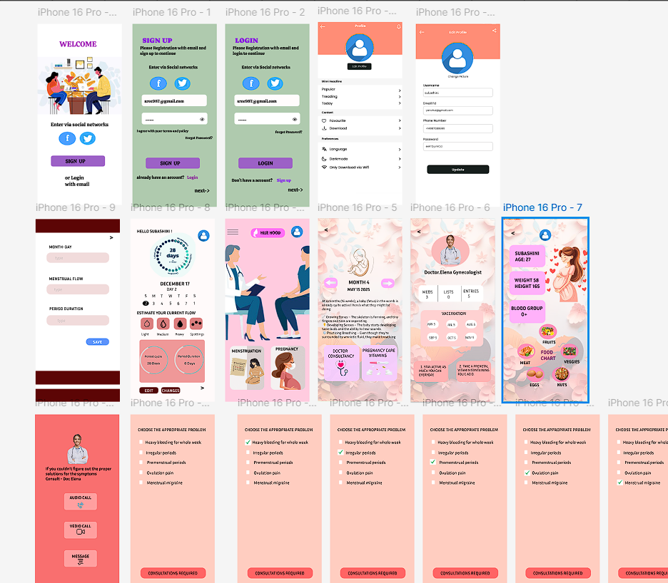
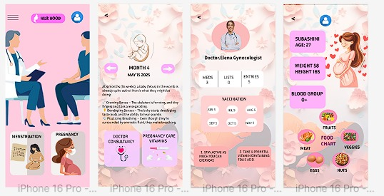
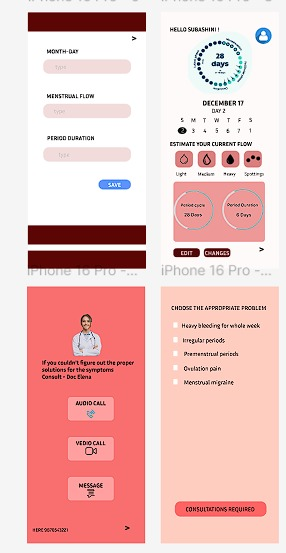
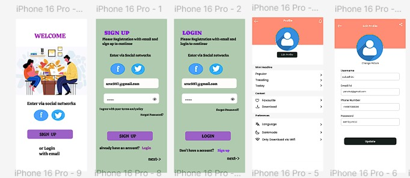

# 🌸 Her Hood - Figma UI/UX Project

## 🔗 Figma Prototype
[Click here to view the design](https://www.figma.com/design/LsJZeBmBUcyNVhryEmllVw/Her-Hood?node-id=0-1&p=f&t=JnCFUy0Dcqy38HdL-0)

## 📌 About
Her Hood is a UI/UX design focused on creating a safe digital platform for women.

## 🛠 Tool Used
- Figma

## ✨ Features
- Clean UI design
- User-friendly navigation
- Community-based concept

## 🎥 Demo Video
[Click here to watch demo](https://drive.google.com/file/d/1GSE9Yoh6C8Qn4PHETgw0kl6pbPuX2aEB/view?usp=drive_link)

## 📸 Screenshots

   
   
   
   

